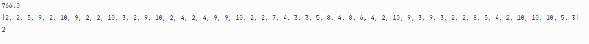

# bestK-kNN
Py program to find the most optimal K hyperparameter to run self-made kNN, optimal is chosen based on the lowest loss of accuracy.
## Usage ##

An example of it being used can be found in [the py file](bestK.py) where the function call looks like this:
```
bestK(X,Y,maxK,maxRow)
most_common_k(array)
```
where array holds all the losses for different range of K's

## Features ##
**X** and **y** are the features and target values respectively\
**maxK** is the maximum K *nearest-neighbors* to run the optimization on\
**maxRow** is the number of rows in X to run kNN on\

## Results ##
For a generic function call the results were as follows
```
bestK(X, Y, 10, 50)
most_common_k(arr)
```

<p align="center">
  
</p>
